<p align="center">
  
</p>

<p align="center">
  
</p>

# 🚀 Awesome AI-Job-Hunting 🎯

*The Privacy-First, Open-Source Autonomous AI-Job-Hunting & Career Automation Engine.*

<p align="center">
  <a href="https://github.com/MadsLorentzen/ai-job-search/actions/workflows/ci.yml"></a>
  
  
  
  
</p>

---

## 🌟 Overview: What is AI-Job-Hunting?

**AI-Job-Hunting** is an advanced, privacy-first career automation platform and intelligent multi-agent workflow engineered to streamline the modern tech job search. Powered by [Claude Code](https://claude.com/claude-code), [Google Antigravity](https://github.com), [OpenAI Codex](https://openai.com), and custom Agent Skills, this framework turns your terminal into a full-stack job application copilot.

✨ **Core Capabilities:**
- 🔍 **Intelligent Job Scraping:** Aggregate openings across LinkedIn, FreeHire, Jobindex, Jobnet, Akademikernes Jobbank, and custom boards.
- 🎯 **Deep Fit Evaluation:** Multi-dimensional scoring (technical skills, experience match, behavioral profile, location, salary).
- 📄 **Tailored LaTeX CVs & Resumes:** Automated LuaLaTeX compilation with pixel-perfect moderncv banking styling.
- ✍️ **Strategic Cover Letters:** High-impact, forward-looking cover letters compiled via XeLaTeX with elegant Lato/Raleway typography.
- 🛡️ **ATS Text-Layer Verification:** Built-in `pdftotext` parsing checks to guarantee applicant tracking system compatibility and prevent font garbling.
- 🎤 **Targeted Interview Preparation:** Role-specific STAR question modeling, company research dossiers, and interactive mock interviews.
- 📈 **Career Analytics & Upskilling:** Skill gap heatmap generation (`/upskill`), HTML application funnel dashboard (`/html-report`), and Notion/Gmail synchronization.

> 🔒 **Privacy Guarantee:** All personal candidate data, CVs, and application history stay strictly on your local machine. No external SaaS cloud storage, zero tracking telemetry, and complete data ownership.

---

## 🏆 Proof of Concept: Does It Actually Work?

> 💬 *"I'm a geophysicist by training. When my role was eliminated in late 2025, I built this **AI-Job-Hunting** framework to automate my own search. 69 tailored applications, 20 first-round interviews, and 1 signed contract later, I started as an AI Engineer in June 2026. It got me hired — now it's yours."*  
> — **Mads Lorentzen** *(Read the full career journey on [LinkedIn](https://www.linkedin.com/in/mads-lorentzen/))*

<p align="center">
  <i>☕ Found this framework valuable? Saved days of manual writing?</i><br>
  <a href="https://ko-fi.com/madslorentzen">
    
  </a>
</p>

---

## 🔄 The AI-Job-Hunting Lifecycle Workflow

```
   ┌──────────────┐         ┌──────────────┐         ┌────────────────────────┐
   │   /setup     │         │   /scrape    │         │  /apply <job-url>      │
   │  Onboarding  │         │ Multi-Portal │         │ Drafter-Reviewer Loop  │
   └──────┬───────┘         └──────┬───────┘         └───────────┬────────────┘
          │                        │                             │
          ▼                        ▼                             ▼
   ┌──────────────┐         ┌──────────────┐         ┌────────────────────────┐
   │ Parse CVs &  │         │ Scrape & Dedup│         │ 1. Evaluate Fit (0-100)│
   │ Documents    │         │ Listings     │         │ 2. Draft LaTeX CV & CL │
   └──────┬───────┘         └──────┬───────┘         │ 3. Reviewer Agent Pass │
          │                        │                 │ 4. Compile & Inspect   │
          ▼                        ▼                 │ 5. ATS Parse Validation│
   ┌──────────────┐         ┌──────────────┐         └───────────┬────────────┘
   │ Canonical    │         │ Shortlist    │                     │
   │ Profile Ready│         │ Matches      │                     ▼
   └──────────────┘         └──────┬───────┘         ┌────────────────────────┐
                                   │                 │ Record to Tracker CSV  │
                                   └────────────────►│ Archive Application    │
                                                     └────────────────────────┘
```

---

## ⚡ Quick Start: Get Running in 5 Minutes

> 🎥 **Video Walkthrough:** [Watch The Next New Thing's Hands-on AI-Job-Hunting Tutorial](https://www.youtube.com/watch?v=HoVxjMNFYv4) for a live step-by-step demonstration.

### 1. Fork and clone

```bash
gh repo fork MadsLorentzen/ai-job-search --clone
cd ai-job-search
```

> [!IMPORTANT]
> **A fork of this repo is always public** — GitHub does not allow private forks of public repositories — and `/setup` (step 3 below) writes your personal data (name, contact details, employment history, salary expectations) into **tracked** files.
> If this copy is for your own job search rather than for contributing changes back, use a **private repository** with this repo as `upstream` instead — the two-minute recipe is in [SETUP.md section 8](SETUP.md#8-pulling-upstream-updates-into-your-fork), and every update workflow works identically. Fork only to contribute.

### 2. Install job search tools

Install the portal search CLI tools powered by Bun:

**PowerShell (Windows):**
```powershell
$tools = @("jobbank-search", "jobdanmark-search", "jobindex-search", "jobnet-search", "linkedin-search", "freehire-search")
foreach ($tool in $tools) {
  Push-Location ".agents/skills/$tool/cli"
  bun install
  Pop-Location
}
```

**Bash / macOS / Linux:**
```bash
for tool in jobbank-search jobdanmark-search jobindex-search jobnet-search linkedin-search freehire-search; do
  (cd .agents/skills/$tool/cli && bun install)
done
```

### 3. Set up your profile

Launch your AI assistant:

```bash
claude
```

Inside Claude Code or Antigravity, run:
```bash
/setup
```

`/setup` provides three flexible onboarding modes:
1. 📂 **Documents Folder Mode:** Automatically indexes your `documents/` folder (master CV, LinkedIn PDF export, diplomas, reference letters).
2. 📋 **Pasted CV Import:** Paste your existing resume directly into chat.
3. 💬 **Interactive Interview Mode:** An AI career advisor interviews you about your achievements, skills, and target preferences.

### 4. Search for jobs

Discover matching positions across all active portals:

```bash
/scrape
```

*Optional filters:* `/scrape "data engineering"` or `/scrape broad` or `/scrape health`.

### 5. Apply to a job

Execute the full automated drafting, reviewing, and PDF compilation workflow:

```bash
/apply https://jobindex.dk/job/1234567
```

*(Or paste raw job text directly if the target website blocks scrapers: `/apply <paste text>`)*

---

## 🛠️ Complete AI-Job-Hunting Command Suite

| Command | Purpose | Key Benefits |
|---------|---------|--------------|
| 🚀 **`/setup`** | Initialize candidate profile | Auto-extracts CVs, LinkedIn PDFs, diplomas, and behavioral profiles. |
| 🔍 **`/scrape`** | Multi-portal job discovery | Searches LinkedIn, FreeHire, Jobindex, and Jobnet; deduplicates results. |
| 🎯 **`/rank`** | Batch triage scraped jobs | Evaluates and ranks multiple vacancies with parallel scoring agents. |
| 📝 **`/apply`** | End-to-end application engine | Drafter-reviewer pipeline generating tailored LaTeX CVs & cover letters. |
| 🎤 **`/interview`** | Stage-specific interview prep | Company research, STAR answer alignment, and interactive mock roleplay. |
| 📊 **`/outcome`** | Application tracking & followups | Records stage updates, drafts followup emails, and archives submissions. |
| 📚 **`/upskill`** | Skill gap analysis & study roadmap | Heatmap of missing competencies with curated open-source & study links. |
| 🌐 **`/notion-sync`** | One-way pipeline sync to Notion | Creates a live mobile-accessible job search dashboard via Notion MCP. |
| 📧 **`/gmail-sync`** | Email status signal detection | Detects interview invites and rejection emails from your inbox. |
| 📊 **`/html-report`** | Offline visual analytics dashboard | Generates self-contained HTML funnel and conversion charts. |
| 🎨 **`/add-template`** | Register custom templates | Add custom LaTeX, Typst, or Markdown resume templates. |
| 🔌 **`/add-portal`** | Generate custom portal skills | Automatically creates search CLIs for your country or regional job board. |
| 🔄 **`/reset`** | Profile or document wipe | Clean slate reset for testing or re-onboarding. |

---

## 🏗️ Architectural Overview & File Structure

```
Awesome-AI-Job-Hunting/
├── CLAUDE.md                          # Main candidate profile + AI-Job-Hunting workflow rules
├── AGENTS.md                          # Multi-agent architectural guidelines & thin-pointer spec
├── .claude/
│   ├── commands/                      # Slash commands (/apply, /setup, /scrape, etc.)
│   ├── skills/                        # Core AI skills (job-application-assistant, upskill)
│   └── settings.json                  # Scoped permission allowlist
├── .agents/skills/                    # Portable Agent Skills (CLI search engines)
│   ├── linkedin-search/               # Global LinkedIn guest search
│   ├── freehire-search/               # Tech job aggregator (REST API)
│   ├── jobindex-search/               # Jobindex.dk scraper
│   ├── jobnet-search/                 # Jobnet.dk (STAR Danish public portal)
│   ├── jobdanmark-search/             # Jobdanmark.dk integration
│   └── jobbank-search/                # Akademikernes Jobbank
├── cv/                                # LaTeX Curriculum Vitae
│   ├── README.md                      # Compilation guidelines & moderncv standards
│   └── main_example.tex               # Reference moderncv banking template
├── cover_letters/                     # LaTeX Cover Letters
│   ├── README.md                      # Typography & cover.cls overview
│   ├── cover.cls                      # Custom LaTeX letter class
│   ├── cover_example.tex              # Reference example letter
│   └── OpenFonts/                     # Lato & Raleway typography
├── company_research/                  # Cached company intelligence & culture dossiers
├── documents/                         # Candidate source materials & application archives
│   ├── cv/                            # Master CVs
│   ├── linkedin/                      # LinkedIn profile PDFs
│   ├── diplomas/                      # Degrees & certifications
│   ├── references/                    # Reference letters
│   └── applications/                  # Past application records (<company>_<role>/)
├── templates/                         # Custom templates registered via /add-template
├── tools/                             # Python maintenance & verification utilities
│   ├── salary_lookup.py               # Salary benchmarking CLI
│   ├── verify_pdf.py                  # ATS text-layer & page-count validator
│   ├── security_guards.py             # Supply chain & permission security checker
│   └── check_upstream_updates.py      # Upstream update conflict previewer
├── job_search_tracker.csv             # Central application tracking spreadsheet
└── SETUP.md                           # Comprehensive environment setup guide
```

---

## 📊 Tooling & Platform Ecosystem Comparison

| Tool / Platform | Category | Primary Function | Open Source / Local? | Pricing / Limits |
|-----------------|----------|------------------|----------------------|------------------|
| **AI-Job-Hunting Framework** | Autonomous CLI | End-to-end job search, LaTeX CV tailoring, ATS checks | ✅ 100% Open Source | **Free & Open Source** (MIT License, runs on local machine) |
| **Claude Code** | AI Agent CLI | Agentic execution harness & workflow engine | ❌ Commercial CLI | **Subscription / API-based** (Claude Pro at $20/mo or Pay-as-you-go API) |
| **Google Antigravity** | Agentic IDE / CLI | Multi-agent execution & pairing environment | ❌ Free Preview | **Free during public preview** (Subject to Google workspace quotas) |
| **FreeHire API** | Job Aggregator | Multi-market tech job discovery API | ✅ Open API | **Free Tier:** Public REST API, no API key required for standard rate |
| **LinkedIn Guest Search** | Job Portal | Unauthenticated job posting search | ❌ Public Web | **Free Tier:** Public guest endpoints (Subject to strict rate limiting) |
| **Notion MCP Server** | Productivity Sync | Live job dashboard integration | ✅ Open Protocol | **Free Tier:** Free Notion workspace with standard block & API limits |

---

## 🔒 Security & Privacy Architecture

The **AI-Job-Hunting** framework follows strict security boundaries to protect sensitive career data:

1. 🛡️ **Untrusted-Input Isolation:** Job postings are treated as raw data, never as executable agent instructions. Prompt injection attempts embedded in job descriptions are ignored.
2. 🚫 **Zero External Uploads:** Your candidate documents, salary benchmarks, and tracker remain strictly on your local filesystem.
3. 🔐 **Permission Allowlist:** `.claude/settings.json` restricts auto-executable commands to pre-approved scripts (`bun run`, `salary_lookup.py`, `pdftotext`).
4. 🧹 **Comprehensive Git-Ignoring:** All generated CVs, personal PDFs, application logs, and scrapers' cache files are excluded by `.gitignore`.

---

## 🤝 Contributing & Community

We welcome contributions to the universal framework! Please review [CONTRIBUTING.md](CONTRIBUTING.md) and [SECURITY.md](SECURITY.md) before opening a pull request.

- 🌍 **Building for your local market?** Use `/add-portal` to scaffold custom job board skills for your country.
- 💬 **Join the Discussion:** Share your portal adaptations in the [Community Forks & Adaptations](https://github.com/MadsLorentzen/ai-job-search/discussions/78) hub.

---

## 📜 License

Distributed under the **MIT License**. Built with ❤️ for job seekers worldwide.
